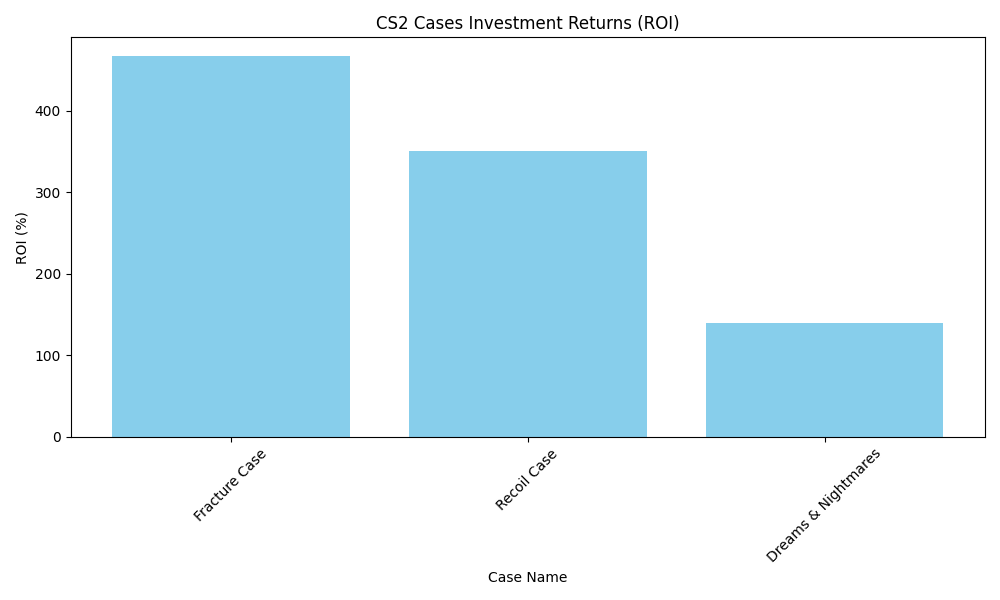

# CS2 Market Analysis & AI Price Prediction 📈🤖

An automated end-to-end data pipeline designed to analyze Counter-Strike 2 (CS2) market trends, log historical data, and forecast future asset prices using Machine Learning.

## 🚀 Key Features
- **Real-time Data Scraping:** Automatically fetches live market prices from the Steam Market API using the `Requests` library.
- **Automated Data Logging:** Implemented a time-series logging system that captures every live price update into a `price_history.csv` database for long-term trend analysis.
- **Data Analysis:** Performs automated ROI (Return on Investment) calculations and data cleaning with `Pandas`.
- **AI Price Forecasting:** Predicts asset values for the next 6 months using a **Linear Regression** model from `Scikit-Learn`.
- **Data Visualization:** Generates dynamic reports to visualize market insights using `Matplotlib`.

## 🛠 Tech Stack
- **Language:** Python
- **AI & Data Science:** Pandas, Scikit-Learn, NumPy, Matplotlib
- **Web Connectivity:** Requests (Steam Market API)

## 📊 Market Insights & AI Forecast
Based on the real-time and historical data processed by the pipeline:
- **Top Performer:** High-demand assets like the **Fracture Case** show significant growth potential with an ROI exceeding **400%**.
- **Historical Tracking:** The system now maintains a persistent log of price fluctuations to refine AI accuracy over time.



## ⚙️ Setup & Installation
1. Clone the repository:
   ```bash
   git clone [https://github.com/DOVANQUANG207/my-first-ai-protect.git](https://github.com/DOVANQUANG207/my-first-ai-protect.git)
