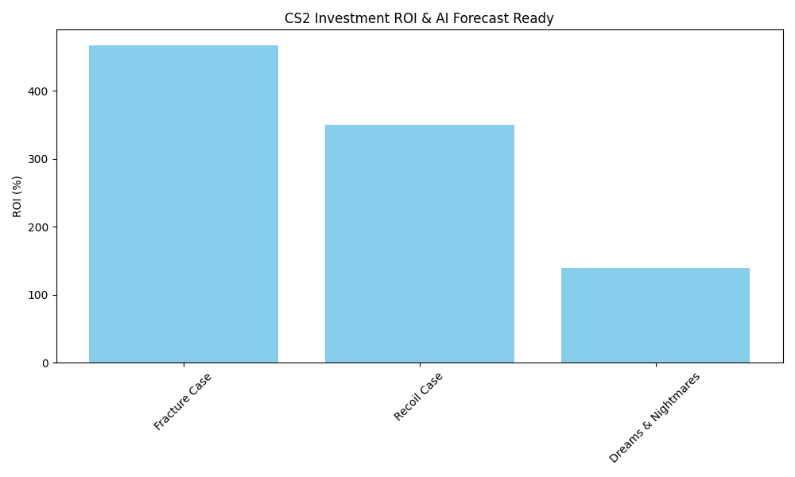

# CS2 Market Analysis & AI Price Prediction 📈🤖

An automated data pipeline built to analyze Counter-Strike 2 (CS2) market trends and forecast future prices using Machine Learning.

## 🚀 Overview
This project processes CS2 case market data to identify high-return investment opportunities. It features:
- **Data Analysis:** Automated ROI (Return on Investment) calculation using Pandas.
- **Data Visualization:** Visualized market trends with Matplotlib.
- **Machine Learning:** Price forecasting for the next 6 months using Scikit-Learn (Linear Regression).

## 🛠 Tech Stack
- **Language:** Python
- **Libraries:** Pandas, Matplotlib, Scikit-Learn, NumPy

## 📊 Key Insights
According to our latest analysis:
- **Top Performer:** Fracture Case with over **400% ROI**.
- **Trend:** AI models predict continued growth for selected cases based on current market velocity.



## ⚙️ Setup & Installation
1. Clone the repository:
   ```bash
   git clone [https://github.com/DOVANQUANG207/my-first-ai-protect.git](https://github.com/DOVANQUANG207/my-first-ai-protect.git)
